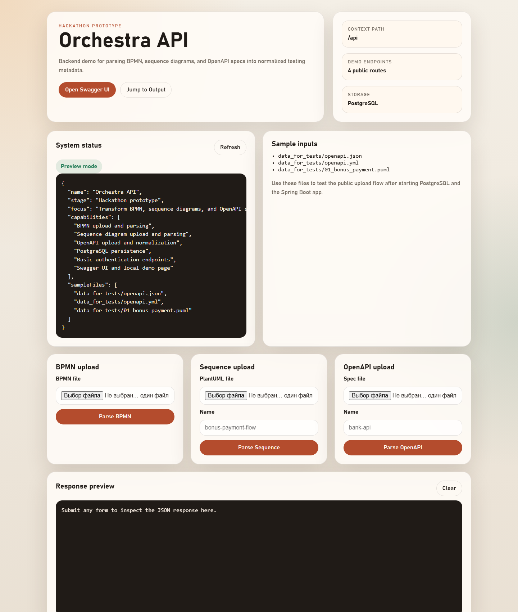

# Orchestra API

Backend prototype created during a VTB hackathon. The public version focuses on one working slice of the idea: upload BPMN diagrams, sequence diagrams, and OpenAPI specifications, parse them, normalize the data, and persist the result in PostgreSQL.

## Why this repository is useful

- shows a real Spring Boot backend with a clear domain focus;
- demonstrates parsing of technical artifacts instead of only CRUD;
- includes authentication, persistence, Swagger, Docker Compose, and demo input files;
- presents the hackathon result honestly as a prototype, not as a finished product.

## My role

In the team project, I focused primarily on the backend side:

- API routes and upload endpoints;
- Spring Boot application structure and configuration;
- persistence flow for uploaded artifacts;
- backend integration around BPMN, sequence, and OpenAPI processing;
- preparing the repository for a public demo-ready presentation.

## Current scope

The repository currently includes:

- BPMN upload and parsing;
- sequence diagram upload and parsing;
- OpenAPI upload and normalization;
- PostgreSQL persistence for diagrams, steps, transitions, and specs;
- authentication endpoints;
- Swagger UI;
- a lightweight local demo page for manual testing.

The repository does not claim to include a finished execution pipeline, full orchestration engine, or production-ready frontend.

## Stack

- Java 17
- Spring Boot 3
- Spring Web
- Spring Data JPA
- Spring Security
- PostgreSQL
- Maven
- Swagger / OpenAPI
- Camunda BPMN model API
- PlantUML-style sequence parsing

## Local demo surfaces

After startup, use:

- Demo page: `http://localhost:8080/api/`
- Swagger UI: `http://localhost:8080/api/swagger-ui/index.html`
- Health check: `http://localhost:8080/api/health`
- System info: `http://localhost:8080/api/system/info`

## Sample files

The repository includes demo inputs in [data_for_tests](data_for_tests):

- `openapi.json`
- `openapi.yml`
- `01_bonus_payment.puml`

They are useful for quick manual validation of the upload flow.
They are sanitized demo artifacts and contain placeholder values only.

## Quick start

Prerequisites:

- Java 17
- Docker / Docker Compose

1. Start PostgreSQL:

```bash
docker compose up -d
```

2. Run the application:

```bash
./mvnw spring-boot:run
```

On Windows PowerShell:

```powershell
.\mvnw.cmd spring-boot:run
```

3. Open the demo page or Swagger UI:

```text
http://localhost:8080/api/
http://localhost:8080/api/swagger-ui/index.html
```

## Default local configuration

- database URL: `jdbc:postgresql://localhost:5433/orchestra_db`
- DB user: `postgres`
- DB password: `postgres`
- HTTP port: `8080`

The schema bootstrap also creates a local demo user:

- email: `demo@orchestra.local`
- password: `Demo123!`

These credentials are intended for local development only.

## Main endpoints

- `POST /api/auth/register`
- `POST /api/auth/login`
- `GET /api/auth/me`
- `POST /api/bpmn/upload`
- `POST /api/sequence/upload`
- `POST /api/openapi/upload`
- `GET /api/health`
- `GET /api/system/info`

## Repository structure

```text
.
|-- data_for_tests/        sample inputs for quick manual validation
|-- docs/                  architecture assets and supporting materials
|-- src/main/java/         Spring Boot application source
|-- src/main/resources/    configuration, schema bootstrap, static demo page
|-- .env.example           local environment variables template
|-- docker-compose.yml     PostgreSQL for local development
`-- pom.xml                Maven build configuration
```

## Architecture

The repository includes [docs/images/Architecture.png](docs/images/Architecture.png).
The local demo page preview is shown in [docs/images/demo-dashboard.png](docs/images/demo-dashboard.png).
Additional demo notes are available in [docs/demo-workflow.md](docs/demo-workflow.md).

High-level flow:

1. a user uploads BPMN, sequence, or OpenAPI artifacts;
2. the backend parses the source into a normalized internal representation;
3. normalized data is stored in PostgreSQL;
4. the stored model becomes a base for future scenario generation and execution logic.

## Limitations

- no dedicated frontend application;
- no complete end-to-end scenario execution engine in the public version;
- no automated test suite yet;
- hackathon origin is still visible in several architectural tradeoffs.

## Notes on sample materials

- sample OpenAPI and sequence files are included for demonstration only;
- credentials, tokens, and identifiers in sample materials are placeholders or local-development examples;
- if the project is extended further, all external sandbox artifacts should remain separated from production code.

## Backlog

- add integration tests for upload flows;
- improve validation and error reporting;
- add a consistent API contract for parsed artifacts;
- extend the prototype into scenario generation and execution;
- add CI checks for Java 17 builds.


